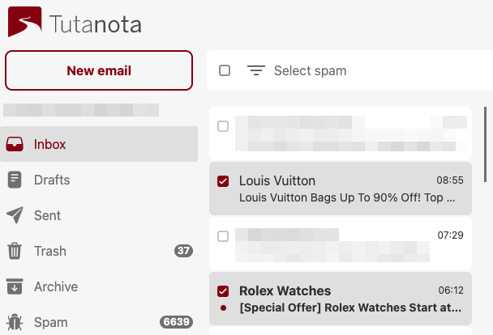

# Tutanospam

A naive bayesian filter for learning and selecting spam client-side in Tutanota. This extension adds a "Select spam" button to the filter bar, and all spam emails are selected when clicked:



Uses [ttezel/bayes: Naive-Bayes Classifier for node.js](https://github.com/ttezel/bayes).

# Notes on Tutanota app

- tutao
  - appState
  - client (= browser)
  - currentView (= MailView)
    - mailViewModel
      - inboxRuleHandler
      - mailModel
        - eventController
          - addEntityListener (triggert meermaals als mail aankomt)
  - lang
  - locator
    - mailModel
  - m (= mithrill)
  - root (= document.body)
  - testError
  
```
tutao.locator.mailModel.getMailboxDetails().then(function (d) { window.d = d; });
const inbox = d[0].folders.getSystemFolderByType("1");
const spamFolder = d[0].folders.getSystemFolderByType("5");
spamFolder.mails = Id mailListId
entityClient.loadRange
const mailTypeRef = {app: "tutanota", type: "Mail"};
tutao.locator.entityClient.loadRange(mailTypeRef, spamFolder.mails, "zzzzzzzzzzzz", 1, true) => promise with mail array
reverse=true: id ("zz..zz" above) is not returned, but the next older mails are, most recent first
reverse=false: id is not returned, but the next newer mails are, oldest first
```

tutao.locator.mailModel.getMailboxDetails().then(details => inbox = details[0].folders.getSystemFolderByType("1"));

mail:
- subject
- toRecipients[]
    - address
- sender
    - address
    - name
- body: Id
- headers: Id
- id: IdTuple
    - 0: list ID
    - 1: element ID

```
listModel.setFilter(mail => mail.isspam)
tutao.currentView.mailViewModel.listModel.setFilter(mail => mail.subject == 'My subject')
tutao.currentView.mailViewModel.listModel.state.unfilteredItems -> many cached mails of the currently viewed folder
alternate mailviewmodel: tutao.locator.mailViewModel().then(mvm => window.mvm = mvm)
```
